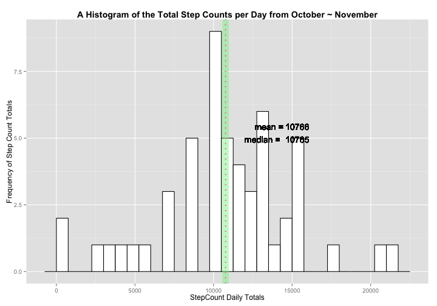
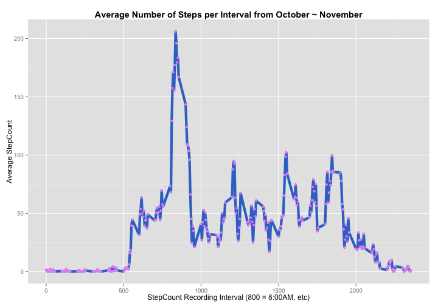
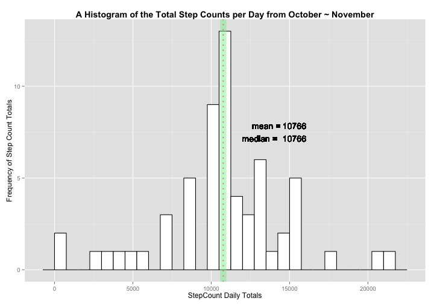
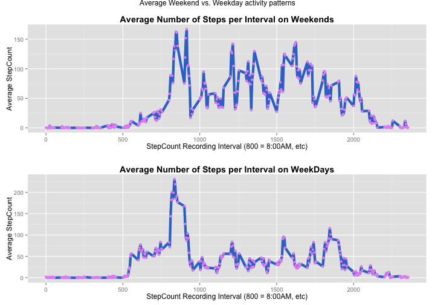

# Wearable Pedometer/Activity Tracker Mini-Study

It is now possible to collect a large amount of data about personal movement using activity monitoring devices such as the Fitbit, Nike Fuelband, Galaxy Gear Fit or Jawbone Up. These type of devices are part of the "quantified self" movement -- a group of enthusiasts who take measurements about themselves regularly to improve their health, to find patterns in their behavior, or to affiliate themselves with the tech community. But, typically, this data remains under-utilized both because the raw data are hard to obtain and because there is a lack of statistical methods and software for processing and interpreting the data that are easily understood by the layperson.

The following short study makes use of data obtained from a personal activity monitoring device. This device collected pedometer (step tracking) data from an anonymous subject at 5 minute intervals through out the day for two months (October ~ November, 2012).

## Loading and preprocessing the data

To begin this study, the reader will need to load a few libraries. If you have not installed them you will need to install ggplot, gridExtra and dplyr using:

1. install.packages("ggplots")
2. install.packages("gridExtra")
3. install.packages("dplyr"). 

These installs must be done manually, as I wont install packages on the readers machine. 


```r
# load the libraries we will need
library(ggplot2)
library(dplyr)
library(gridExtra)
```

The activity data is provided in the github repo and can be downloaded from the following URL:

https://d396qusza40orc.cloudfront.net/repdata%2Fdata%2Factivity.zip

The following R code "Chunk"" provides a method for obtaining the data that accounts for both scenarios where the file needs to be downloaded, unzipped, both or is otherwise present in the root directory where the .Rmd file is located. 


```r
if(file.exists("./activity.csv")){
                print("Dataset already downloaded and unzipped")
                print("Loading Data...")
}else if(file.exists("./repdata-data-activity.zip")){
                print("Dataset downloaded. Now Unzipping...")
                unzip("./repdata-data-activity.zip")
                print("Completed.")
                print("Loading Data...")
}else if(!file.exists("./repdata-data-activity.zip")){
                print("Downloading and unzipping dataset...")
                download.file("http://d396qusza40orc.cloudfront.net/repdata%2Fdata%2Factivity.zip","./repdata-data-activity.zip")
                unzip("./repdata-data-activity.zip")
                print("Completed.")
                print("Loading Data...")
}
```

```
## [1] "Dataset already downloaded and unzipped"
## [1] "Loading Data..."
```

```r
##read file using read.csv
activityData<-read.csv("./activity.csv", header=TRUE, sep=",", )
##convert date column from factor to Date class
activityData$date<-as.Date(activityData$date)
##provide a summary of the activityData table
summary(activityData)
```

```
##      steps            date               interval   
##  Min.   :  0.0   Min.   :2012-10-01   Min.   :   0  
##  1st Qu.:  0.0   1st Qu.:2012-10-16   1st Qu.: 589  
##  Median :  0.0   Median :2012-10-31   Median :1178  
##  Mean   : 37.4   Mean   :2012-10-31   Mean   :1178  
##  3rd Qu.: 12.0   3rd Qu.:2012-11-15   3rd Qu.:1766  
##  Max.   :806.0   Max.   :2012-11-30   Max.   :2355  
##  NA's   :2304
```

```r
## variables for documenting the observations and variables for the activity dataset
obs<-nrow(activityData)
vars<-ncol(activityData)
```

The file, "activity.csv", consists of 17568 observation of 3 variables.

As you can see in the summary, this data set has a number of NA observations, or observations where data is missing. I first want to create a dataset that has those NAs removed (We will impute this missing data later). In this dataset I will also make the date a factor which will help me when I subset the data using dplyr.


```r
activityDataComplete <- na.omit(activityData)
activityDataComplete$date <- as.factor(activityDataComplete$date)
##provide a summary of the activityDataComplete table
summary(activityDataComplete)
```

```
##      steps               date          interval   
##  Min.   :  0.0   2012-10-02:  288   Min.   :   0  
##  1st Qu.:  0.0   2012-10-03:  288   1st Qu.: 589  
##  Median :  0.0   2012-10-04:  288   Median :1178  
##  Mean   : 37.4   2012-10-05:  288   Mean   :1178  
##  3rd Qu.: 12.0   2012-10-06:  288   3rd Qu.:1766  
##  Max.   :806.0   2012-10-07:  288   Max.   :2355  
##                  (Other)   :13536
```

```r
## variables for documenting the observations and variables for the activity dataset
obs2<-nrow(activityDataComplete)
vars2<-ncol(activityDataComplete)
```

The activityDataComplete table consists of only 15264 observation of 3 variables.

## What is mean total number of steps taken per day? The median?

To subset the data, calculate the sum, median and mean of the daily step count, I have created a third data set based on the activityDataCleaned dataset. I am using Hadley Wickham's dplyr package. The package is fast and elegant and uses a new syntax that is becoming very popular for its readability. 


```r
calcActivity <- activityDataComplete %.% 
        group_by(date) %.% 
        summarise (step.sum = sum(steps), step.mean = round(mean(steps)), step.median=median(steps)) 
calcActivity
```

```
## Source: local data frame [53 x 4]
## 
##          date step.sum step.mean step.median
## 1  2012-10-02      126         0           0
## 2  2012-10-03    11352        39           0
## 3  2012-10-04    12116        42           0
## 4  2012-10-05    13294        46           0
## 5  2012-10-06    15420        54           0
## 6  2012-10-07    11015        38           0
## 7  2012-10-09    12811        44           0
## 8  2012-10-10     9900        34           0
## 9  2012-10-11    10304        36           0
## 10 2012-10-12    17382        60           0
## 11 2012-10-13    12426        43           0
## 12 2012-10-14    15098        52           0
## 13 2012-10-15    10139        35           0
## 14 2012-10-16    15084        52           0
## 15 2012-10-17    13452        47           0
## 16 2012-10-18    10056        35           0
## 17 2012-10-19    11829        41           0
## 18 2012-10-20    10395        36           0
## 19 2012-10-21     8821        31           0
## 20 2012-10-22    13460        47           0
## 21 2012-10-23     8918        31           0
## 22 2012-10-24     8355        29           0
## 23 2012-10-25     2492         9           0
## 24 2012-10-26     6778        24           0
## 25 2012-10-27    10119        35           0
## 26 2012-10-28    11458        40           0
## 27 2012-10-29     5018        17           0
## 28 2012-10-30     9819        34           0
## 29 2012-10-31    15414        54           0
## 30 2012-11-02    10600        37           0
## 31 2012-11-03    10571        37           0
## 32 2012-11-05    10439        36           0
## 33 2012-11-06     8334        29           0
## 34 2012-11-07    12883        45           0
## 35 2012-11-08     3219        11           0
## 36 2012-11-11    12608        44           0
## 37 2012-11-12    10765        37           0
## 38 2012-11-13     7336        25           0
## 39 2012-11-15       41         0           0
## 40 2012-11-16     5441        19           0
## 41 2012-11-17    14339        50           0
## 42 2012-11-18    15110        52           0
## 43 2012-11-19     8841        31           0
## 44 2012-11-20     4472        16           0
## 45 2012-11-21    12787        44           0
## 46 2012-11-22    20427        71           0
## 47 2012-11-23    21194        74           0
## 48 2012-11-24    14478        50           0
## 49 2012-11-25    11834        41           0
## 50 2012-11-26    11162        39           0
## 51 2012-11-27    13646        47           0
## 52 2012-11-28    10183        35           0
## 53 2012-11-29     7047        24           0
```


Now that I have all the data subset and calculated it's possible to show the distribution of steps across the two month recording window in a histogram with the daily stepcount mean and median provided in the legend.


```r
dMean <- round(mean(calcActivity$step.sum))
dMedian <- median(calcActivity$step.sum)

p <- ggplot(calcActivity, aes(x=step.sum)) + geom_histogram(binwidth=750, colour="black", fill="white")
p <- p+geom_vline(aes(xintercept=dMean), color="#80F28A", size = 5, linetype = "solid", alpha=0.45)
p <- p+geom_vline(aes(xintercept=dMedian), color="#E293C0", linetype = "dotted", size=1, alpha=1)
p <-  p+ggtitle("A Histogram of the Total Step Counts per Day from October ~ November")+ theme(plot.title = element_text(lineheight=.8, face="bold"))
p<-p+xlab("StepCount Daily Totals") + ylab("Frequency of Step Count Totals")
p <- p+geom_text(aes(dMean,0,label = "mean =", hjust=-1, vjust = -23))
p <- p+geom_text(aes(dMean,0,label = dMean, hjust=-2.5, vjust = -23))
p <- p+geom_text(aes(dMedian,0,label = dMedian, hjust=-2.5, vjust = -21))
p <- p+geom_text(aes(dMedian,0,label = "median = ", hjust=-0.5, vjust = -21))
p
```

 


the mean stepcount (October~November): 1.0766 &times; 10<sup>4</sup>

the mean stepcount (October~November): 10765

## What is the average daily activity pattern?

To observe the pedometer wearer's daily activity we can look at the number of steps in each interval across a given day. This would give us a general trend line for the users activity in that day. If we take the mean of each intervals across every day in the two month recording window, we might be able to observe the users overall activity patterns during the sample period.


```r
##make a new complete and clean data set
activityDataComplete2 <- na.omit(activityData)
## convert the interval col to a factor
activityDataComplete2$interval <- as.factor(activityDataComplete2$interval)
##group by interval factor and average
calcActivity2 <- activityDataComplete2 %.% 
        group_by(interval) %.% 
        summarise (step.mean = mean(steps))
calcActivity2
```

```
## Source: local data frame [288 x 2]
## 
##    interval step.mean
## 1         0   1.71698
## 2         5   0.33962
## 3        10   0.13208
## 4        15   0.15094
## 5        20   0.07547
## 6        25   2.09434
## 7        30   0.52830
## 8        35   0.86792
## 9        40   0.00000
## 10       45   1.47170
## ..      ...       ...
```


```r
l <- ggplot(data=calcActivity2, aes(x=as.numeric(levels(interval))[interval], y=step.mean, group=1)) + geom_line(colour="#3A75CD", linetype="solid", size=2) + geom_point(colour="#EB92F7", size=1.5, shape=21, fill="#EB92F7")
l <- l + scale_x_continuous(breaks=c(0,500,1000, 1500, 2000, 2500))
l <- l + ggtitle("Average Number of Steps per Interval from October ~ November")+ theme(plot.title = element_text(lineheight=.8, face="bold"))
l <- l + xlab("StepCount Recording Interval (800 = 8:00AM, etc)") + ylab("Average StepCount")
l
```

 

In order to find the most active time of the day, on average, across the 2 month recording window (aka, the most active interval on average), we would only need to call the following code chunk in R:

```r
calcActivity2[which.max(calcActivity2$step.mean),]
```

```
## Source: local data frame [1 x 2]
## 
##     interval step.mean
## 104      835     206.2
```

The most active interval for this anon user is ~ 200+ steps at the 8:35AM interval.

## Imputing missing values

Missing values are a problem with any activity tracking dataset. The user occasionaly forgets to wear their pedometer or the battery dies and data will be missing. There are packages like impute and others designed to fill in this missing data with logical equivalents. In this examples we will use a more simple method and use our list of average steps per interval to fill in the missing data.

First we can make an array with the missing values

```r
missingValues<-activityData[which(is.na(activityData)),]
```

and we can determine how many missing values there are using either summary orthe following code chunk:


```r
nrow(missingValues)
```

```
## [1] 2304
```

And now we can loop through our original dataActivity dataset and select the intervals where the step count is equal to NA and replace those "steps" with the step.mean of the same index from our calcactivity2 dataset (which was a the daily averages for each interval minus the NAs).

I will copy the orginal dataset into a new tmp dataset (ad) in order to preserve the original data with NAs


```r
ad<- activityData
for(i in 1:nrow(ad)){
        if(is.na(ad[i,]$steps)){
                tmp<-ad[i,]$interval  
                ad[i,]$steps <- calcActivity2[which(calcActivity2$interval==tmp),]$step.mean
        }        
}
summary(ad)
```

```
##      steps            date               interval   
##  Min.   :  0.0   Min.   :2012-10-01   Min.   :   0  
##  1st Qu.:  0.0   1st Qu.:2012-10-16   1st Qu.: 589  
##  Median :  0.0   Median :2012-10-31   Median :1178  
##  Mean   : 37.4   Mean   :2012-10-31   Mean   :1178  
##  3rd Qu.: 27.0   3rd Qu.:2012-11-15   3rd Qu.:1766  
##  Max.   :806.0   Max.   :2012-11-30   Max.   :2355
```

Now we can perform our original calculations to compute a new histogram. This will be the same calculations as before except the NAs that we removed before have now been imputed with daily averages and we can see the overall effect of the imputation on the mean, median and daily averages.


```r
calcActivity3 <- ad %.% 
        group_by(date) %.% 
        summarise (step.sum = sum(steps), step.mean = round(mean(steps)), step.median=median(steps)) 
calcActivity3
```

```
## Source: local data frame [61 x 4]
## 
##          date step.sum step.mean step.median
## 1  2012-10-01    10766        37       34.11
## 2  2012-10-02      126         0        0.00
## 3  2012-10-03    11352        39        0.00
## 4  2012-10-04    12116        42        0.00
## 5  2012-10-05    13294        46        0.00
## 6  2012-10-06    15420        54        0.00
## 7  2012-10-07    11015        38        0.00
## 8  2012-10-08    10766        37       34.11
## 9  2012-10-09    12811        44        0.00
## 10 2012-10-10     9900        34        0.00
## 11 2012-10-11    10304        36        0.00
## 12 2012-10-12    17382        60        0.00
## 13 2012-10-13    12426        43        0.00
## 14 2012-10-14    15098        52        0.00
## 15 2012-10-15    10139        35        0.00
## 16 2012-10-16    15084        52        0.00
## 17 2012-10-17    13452        47        0.00
## 18 2012-10-18    10056        35        0.00
## 19 2012-10-19    11829        41        0.00
## 20 2012-10-20    10395        36        0.00
## 21 2012-10-21     8821        31        0.00
## 22 2012-10-22    13460        47        0.00
## 23 2012-10-23     8918        31        0.00
## 24 2012-10-24     8355        29        0.00
## 25 2012-10-25     2492         9        0.00
## 26 2012-10-26     6778        24        0.00
## 27 2012-10-27    10119        35        0.00
## 28 2012-10-28    11458        40        0.00
## 29 2012-10-29     5018        17        0.00
## 30 2012-10-30     9819        34        0.00
## 31 2012-10-31    15414        54        0.00
## 32 2012-11-01    10766        37       34.11
## 33 2012-11-02    10600        37        0.00
## 34 2012-11-03    10571        37        0.00
## 35 2012-11-04    10766        37       34.11
## 36 2012-11-05    10439        36        0.00
## 37 2012-11-06     8334        29        0.00
## 38 2012-11-07    12883        45        0.00
## 39 2012-11-08     3219        11        0.00
## 40 2012-11-09    10766        37       34.11
## 41 2012-11-10    10766        37       34.11
## 42 2012-11-11    12608        44        0.00
## 43 2012-11-12    10765        37        0.00
## 44 2012-11-13     7336        25        0.00
## 45 2012-11-14    10766        37       34.11
## 46 2012-11-15       41         0        0.00
## 47 2012-11-16     5441        19        0.00
## 48 2012-11-17    14339        50        0.00
## 49 2012-11-18    15110        52        0.00
## 50 2012-11-19     8841        31        0.00
## 51 2012-11-20     4472        16        0.00
## 52 2012-11-21    12787        44        0.00
## 53 2012-11-22    20427        71        0.00
## 54 2012-11-23    21194        74        0.00
## 55 2012-11-24    14478        50        0.00
## 56 2012-11-25    11834        41        0.00
## 57 2012-11-26    11162        39        0.00
## 58 2012-11-27    13646        47        0.00
## 59 2012-11-28    10183        35        0.00
## 60 2012-11-29     7047        24        0.00
## 61 2012-11-30    10766        37       34.11
```


```r
dMean3 <- round(mean(calcActivity3$step.sum))
dMedian3 <- round(median(calcActivity3$step.sum))

p <- ggplot(calcActivity3, aes(x=step.sum)) + geom_histogram(binwidth=750, colour="black", fill="white")
p <- p+geom_vline(aes(xintercept=dMean), color="#80F28A", size = 5, linetype = "solid", alpha=0.45)
p <- p+geom_vline(aes(xintercept=dMedian), color="#E293C0", linetype = "dotted", size=1, alpha=1)
p <-  p+ggtitle("A Histogram of the Total Step Counts per Day from October ~ November")+ theme(plot.title = element_text(lineheight=.8, face="bold"))
p<-p+xlab("StepCount Daily Totals") + ylab("Frequency of Step Count Totals")
p <- p+geom_text(aes(dMean3,0,label = "mean =", hjust=-1, vjust = -23))
p <- p+geom_text(aes(dMean3,0,label = dMean3, hjust=-2.5, vjust = -23))
p <- p+geom_text(aes(dMedian3,0,label = dMedian3, hjust=-2.5, vjust = -21))
p <- p+geom_text(aes(dMedian3,0,label = "median = ", hjust=-0.5, vjust = -21))

p
```

 

The new calculations are nearly identical to the first histogram with the NAs removed. The imputation had only a small effect on the overall median. 

the mean stepcount (October~November): 1.0766 &times; 10<sup>4</sup>

the mean stepcount (October~November): 1.0766 &times; 10<sup>4</sup>

## Are there differences in activity patterns between weekdays and weekends?

The last plot will explore the differences in activity patterns on the weekend vs the weekday. I will make a plot similar to the line plot above, where the steps per interval are averaged across every day during the two month sample period. We will seperate the weekends from the weekdays, by a new factor column, to look at the two time periods seperately. 

First we need to create a new column in our data frame to be able to select for weekends or weekdays. First, we will need to convert our date to a Date class.


```r
ad$date <- as.Date(ad$date)
class(ad$date)
```

```
## [1] "Date"
```

```r
tmp2<-ad
```

Then we can create the new column using dplyr and the weekday() function. I will also convert this character to a factor to prepare for grouping and summary operations.


```r
##mutate a new col using weekdays, an inline ifelse and dplyr
tmp3 <- mutate(tmp2, day = ifelse(weekdays(ad$date)=="Sunday" | weekdays(ad$date)=="Saturday", "weekend", "weekday"))

## convert to a factor
tmp3$day<-as.factor(tmp3$day)
##provide a summary to confirm
summary(tmp3)
```

```
##      steps            date               interval         day       
##  Min.   :  0.0   Min.   :2012-10-01   Min.   :   0   weekday:12960  
##  1st Qu.:  0.0   1st Qu.:2012-10-16   1st Qu.: 589   weekend: 4608  
##  Median :  0.0   Median :2012-10-31   Median :1178                  
##  Mean   : 37.4   Mean   :2012-10-31   Mean   :1178                  
##  3rd Qu.: 27.0   3rd Qu.:2012-11-15   3rd Qu.:1766                  
##  Max.   :806.0   Max.   :2012-11-30   Max.   :2355
```

Using the dplyr package again, we group and summarise the data by the weekend and weekday factor


```r
##group by interval factor and average
tmp3$interval <- as.factor(tmp3$interval)

calcActivity5 <- tmp3 %.% 
        filter(day=="weekend") %.%
        group_by(interval) %.% 
        summarise (step.mean = mean(steps))
calcActivity5
```

```
## Source: local data frame [288 x 2]
## 
##    interval step.mean
## 1         0  0.214623
## 2         5  0.042453
## 3        10  0.016509
## 4        15  0.018868
## 5        20  0.009434
## 6        25  3.511792
## 7        30  0.066038
## 8        35  0.108491
## 9        40  0.000000
## 10       45  0.558962
## ..      ...       ...
```

```r
calcActivity4 <- tmp3 %.% 
        filter(day=="weekday") %.%
        group_by(interval) %.% 
        summarise (step.mean = mean(steps))
calcActivity4
```

```
## Source: local data frame [288 x 2]
## 
##    interval step.mean
## 1         0   2.25115
## 2         5   0.44528
## 3        10   0.17317
## 4        15   0.19790
## 5        20   0.09895
## 6        25   1.59036
## 7        30   0.69266
## 8        35   1.13795
## 9        40   0.00000
## 10       45   1.79623
## ..      ...       ...
```

And then create one line plot for each of the average weekend and weekday activities, by sample interval, across the two month sample period.


```r
l <- ggplot(data=calcActivity5, aes(x=as.numeric(levels(interval))[interval], y=step.mean, group=1)) + geom_line(colour="#3A75CD", linetype="solid", size=2) + geom_point(colour="#EB92F7", size=1.5, shape=21, fill="#EB92F7")
l <- l + scale_x_continuous(breaks=c(0,500,1000, 1500, 2000, 2500))
l <- l + ggtitle("Average Number of Steps per Interval on Weekends")+ theme(plot.title = element_text(lineheight=.8, face="bold"))
l <- l + xlab("StepCount Recording Interval (800 = 8:00AM, etc)") + ylab("Average StepCount")
```

```r
r <- ggplot(data=calcActivity4, aes(x=as.numeric(levels(interval))[interval], y=step.mean, group=1)) + geom_line(colour="#3A75CD", linetype="solid", size=2) + geom_point(colour="#EB92F7", size=1.5, shape=21, fill="#EB92F7")
r <- r + scale_x_continuous(breaks=c(0,500,1000, 1500, 2000, 2500))
r <- r + ggtitle("Average Number of Steps per Interval on WeekDays")+ theme(plot.title = element_text(lineheight=.8, face="bold"))
r <- r + xlab("StepCount Recording Interval (800 = 8:00AM, etc)") + ylab("Average StepCount")
```

we can use the gridExtra package to arrange these two plots in the same panel.


```r
grid.arrange(l,r, nrow=2, main="Average Weekend vs. Weekday activity patterns")
```

 

We can see that the anon user had a higher activity level on average throughout the day on the weekend but a lower peak activity level between 5AM ~ 10AM. This could be for a number of reasons including sedentary office work and a morning commute on foot during the weekdays vs more distributed (across the day) and sustained activity on the weekends.